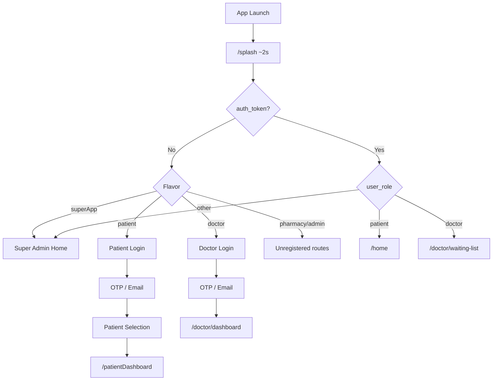
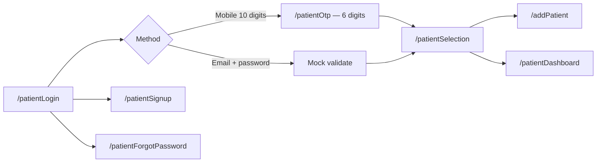
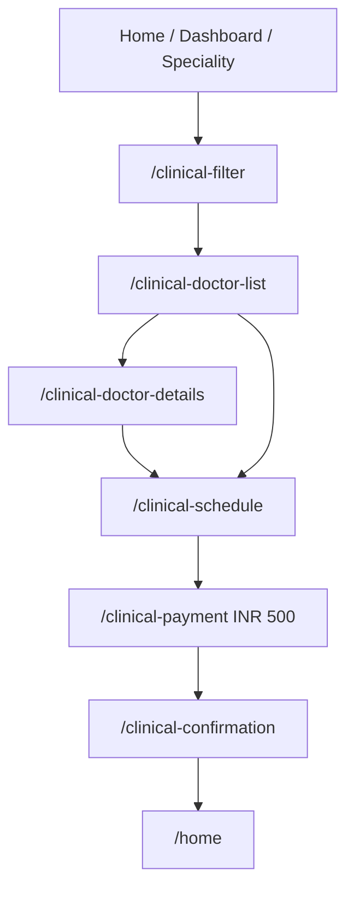
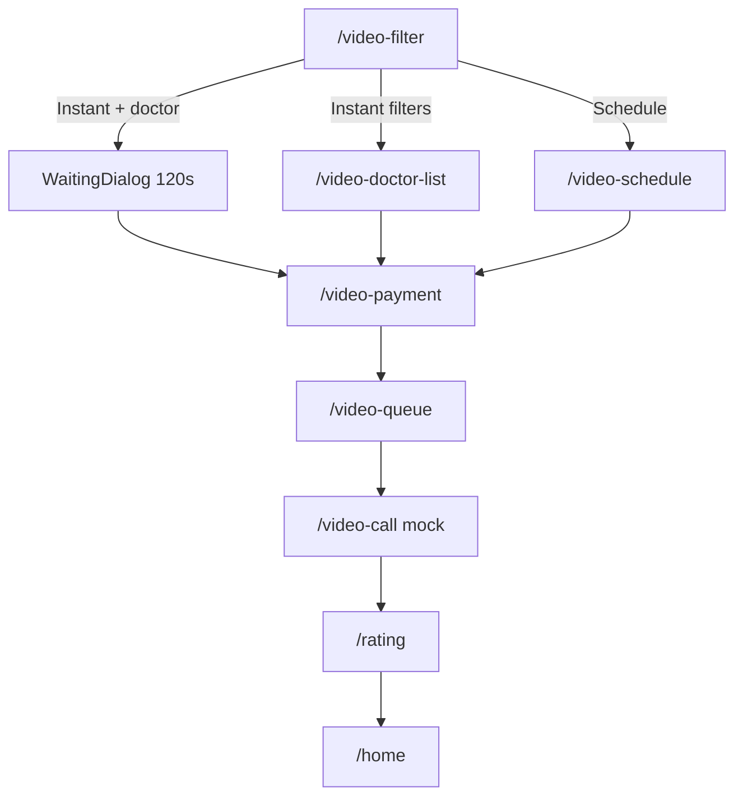
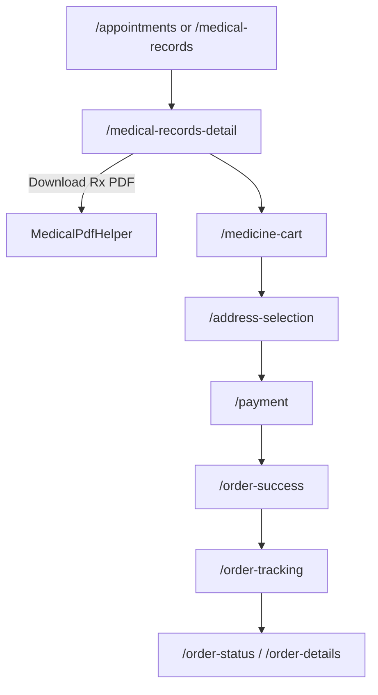
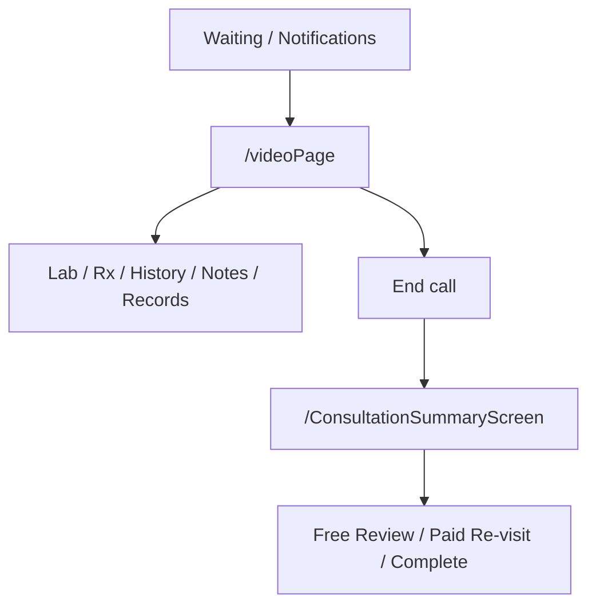

# TimesMed — Mobile Application Flow Documentation

| Field | Value |
|-------|-------|
| **Product** | TimesMed Health Care |
| **Platform** | Flutter (Android / iOS / desktop targets) |
| **Source of truth** | `lib/routes/app_pages.dart`, `lib/routes/app_routes.dart`, `lib/modules/**` |
| **Version** | 3.0 |
| **Last updated** | 20 July 2026 |
| **Analysis scope** | Full `lib/` codebase (~208 Dart files) |
| **Companion** | [`BACKEND_REQUIREMENTS_SPECIFICATION.md`](BACKEND_REQUIREMENTS_SPECIFICATION.md) |

> This document describes **what the mobile app does today** (screens, routes, data shapes, gaps). Backend engineers should use the BRS for the target API contract.

---

## Table of Contents

1. [Overview](#1-overview)
2. [Architecture](#2-architecture)
3. [App Flavors & Entry Points](#3-app-flavors--entry-points)
4. [High-Level Application Flow](#4-high-level-application-flow)
5. [Splash & Authentication](#5-splash--authentication)
6. [Super App Flow](#6-super-app-flow)
7. [Patient Flow (Complete)](#7-patient-flow-complete)
8. [Doctor Flow (Complete)](#8-doctor-flow-complete)
9. [Pharmacy & Admin Modules](#9-pharmacy--admin-modules)
10. [Shared Features](#10-shared-features)
11. [PDF & Print Behaviour](#11-pdf--print-behaviour)
12. [Payments Summary](#12-payments-summary)
13. [Route Reference](#13-route-reference)
14. [Known Gaps & Implementation Status](#14-known-gaps--implementation-status)
15. [Technical Notes](#15-technical-notes)
16. [Appendix: End-to-End Journeys](#appendix-end-to-end-user-journeys)

---

## 1. Overview

TimesMed is a multi-role healthcare mobile application. The Flutter codebase ships as a **super-app** (role picker) or as **patient-only** / **doctor-only** flavors.

**Working product surfaces today**

| Role | Capability |
|------|------------|
| Patient | Login UI, family selection, clinical & video booking UI, medical records, **prescription PDF download**, medicine cart/order UI, lab booking UI, profile, AI chat |
| Doctor | Login UI, shell (dashboard/calendar/waiting/calls/missed), mock video call, Rx/templates, lab request, clinical notes, hospital & hired-doctor management (local), notifications UI |
| Pharmacy / Admin | Route constants + pharmacy empty login only — **not product-ready** |
| Receptionist / clinic admin | **Not present** in code, routes, or flavors |

**Current data reality**

| Item | Status |
|------|--------|
| Feature data | Dummy / in-memory + `Future.delayed` mocks |
| `ApiClient` | Class exists under `lib/core/network/` — **never constructed or called** from any feature |
| Endpoint stubs | Only `/Login/Login_Check`, `/Login/Logout` (unused legacy paths) |
| Auth persistence | `SecureStorage` ready; login **never** writes `auth_token` / `user_role` |
| Razorpay | Client test key; **no** server `order_id` |
| Base URL | Mains use `https://yourapi.com/api` (placeholder); unused endpoint class has legacy `mtmlinelist.tn.gov.in` |

---

## 2. Architecture

| Layer | Technology | Purpose |
|-------|-----------|---------|
| UI | Flutter widgets | Screens, layouts |
| State (partial) | GetX | Login, splash, home, cart, medical records, video filter/list, address, orders, notifications, theme |
| State (rest) | StatefulWidget | Most doctor screens, many booking pages |
| Navigation | `go_router` | Shells, push flows |
| DI | GetX Bindings | Per-route controllers |
| Storage | `flutter_secure_storage` | Tokens/role; also `doctor_profile`, `doctor_registry` |
| HTTP | `ApiClient` + Bearer interceptor | Scaffolding only — **zero call sites** |
| Payments | `razorpay_flutter` | Client checkout wrappers |
| Notifications | `flutter_local_notifications` | Local tray (no FCM) |
| PDF (patient) | `pdf` + `path_provider` + `open_filex` | Prescription PDF generate & open |
| Maps | `google_maps_flutter` | Labs / address UIs |

### Project structure

```
lib/
├── main.dart / main_patient.dart / main_doctor.dart
├── app/app.dart
├── core/          # config, network, storage, widgets, services
├── routes/        # app_routes.dart, app_pages.dart
└── modules/
    ├── splash/  super/  patient/  doctor/  pharmacy/  ai_chat/  auth/
```

No `lib/modules/admin/`. No `main_pharmacy.dart` / `main_admin.dart`.

---

## 3. App Flavors & Entry Points

| Flavor | Entry | Splash (no token) | Splash (with token + role) |
|--------|-------|-------------------|----------------------------|
| `superApp` | `lib/main.dart` | `/superAdminHome` | role home |
| `patient` | `lib/main_patient.dart` | `/patientLogin` | `/home` |
| `doctor` | `lib/main_doctor.dart` | `/doctorLogin` | `/doctor/waiting-list` |
| `pharmacy` | *(no main)* | `/pharmacyLogin` *(not in GoRouter)* | `/pharmacyHome` *(not registered)* |
| `admin` | *(no main)* | `/adminLogin` *(not registered)* | `/adminDashboard` *(not registered)* |

**Bootstrap (wired mains):** `AppConfig` → `DoctorProfileStore.load()` → `DoctorRegistry.instance.load()` → `LocalNotificationService.init()` → `MyApp` → GoRouter initial `/splash`.

```bash
flutter build apk --release -t lib/main.dart
flutter build apk --release -t lib/main_patient.dart
flutter build apk --release -t lib/main_doctor.dart
```

---

## 4. High-Level Application Flow



### Auth gate reality

| Mechanism | Today |
|-----------|--------|
| GoRouter `redirect` | Always `null` — **no route guard** |
| Splash | Only gate (token/role after ~2s) |
| Login success | Mock delay; **does not** `saveToken` / `saveRole` |
| Practical result | Fresh installs always take the no-token path |

---

## 5. Splash & Authentication

### 5.1 Splash (`/splash`)

`splash/view/splash_view.dart` + `splash/controller/splash_controller.dart`

### 5.2 Patient auth



| Screen | Route | Notes |
|--------|-------|-------|
| Login | `/patientLogin` | Mobile OTP or email/password |
| OTP | `/patientOtp` | 6-digit mock verify |
| Signup | `/patientSignup` | Form only — no submit API |
| Forgot password | `/patientForgotPassword` | Phone → OTP → new password (local only) |
| Selection | `/patientSelection` | Family profiles; Continue requires selection |
| Add patient | `/addPatient` | Dependent form; Register button empty |

**Signup fields:** name, email, DOB, age, gender (`Male`/`Female`/`Others`), phone, password, confirm, marital (`Single`/`Married`).

**Add patient fields:** photo, first/last name, DOB, age, gender, marital, relationship (`Son`/`Daughter`/`Wife`/`Brother`/`Sister`/`Friend`).

**Selection model:** `id`, `name`, `relation`, `gender`, `age` — selected patient is **not** persisted globally.

### 5.3 Doctor auth

| Screen | Route | Notes |
|--------|-------|-------|
| Login | `/doctorLogin` | Mobile OTP or email + **exactly 6-digit** password |
| OTP | `/OtpPage` | Verify → `/doctor/dashboard` |

Forgot password on doctor login is a no-op. Sign-up link opens **patient** signup. AI chip → `/aiChat` with `extra: 'doctor'`.

**Landing mismatch:** Login success → Dashboard; splash-with-token → Waiting List.

---

## 6. Super App Flow

**Route:** `/superAdminHome` — `super/view/super_home_view.dart`

| Card | Target | In GoRouter? |
|------|--------|--------------|
| Patient | `/patientLogin` | Yes |
| Doctor | `/doctorLogin` | Yes |
| Pharmacy | `/pharmacyLogin` | **No** |
| Admin | `/adminLogin` | **No** |

---

## 7. Patient Flow (Complete)

### 7.1 Shell (bottom nav)

`patient_main/view/patient_main_page.dart` — `ShellRoute`

| Tab | Route | Screen | User can |
|-----|-------|--------|----------|
| Home | `/home` | Clinical/video CTAs, specialities, upcoming (mock) | Start clinical/video booking |
| Appointments | `/appointments` | Previous visits via medical records mock | Open record detail |
| Dashboard | `/patientDashboard` | Stat tiles + book bar | Navigate to booking/services |
| Services | `/services` | Tabs: Orders \| Lab Track | View orders / track labs |
| Profile | `/profile` | Profile, logout, shortcuts | Logout clears SecureStorage |

Global AI FAB → `/aiChat` (`extra: 'patient'`). Booking/payment flows are pushed **outside** the shell.

### 7.2 Dashboard tiles

| Tile | Route |
|------|-------|
| Doctor Appointment | `/clinical-filter` |
| Online Consultation | `/video-filter` |
| Health Package | `/services` |
| Health Records | `/appointments` |
| Emergency Details | `null` (not wired) |
| Lab Request | `/patient-lab-nearby-lab` *(missing required `List<LabTest>` extra)* |
| Pharma Orders | `/order` |
| Home Care / Wallet | `null` (not wired) |
| Book New Appointment | `/clinical-filter` |

Date range UI exists but does not filter counts (always mock `0`).

### 7.3 Clinical visit booking



| Step | Route | UI contract |
|------|-------|-------------|
| Filter | `/clinical-filter` | city, location, hospital, speciality |
| List | `/clinical-doctor-list` | name, degree, speciality, experience, fee, image |
| Details | `/clinical-doctor-details` | tabs; Photos/Videos Coming Soon |
| Schedule | `/clinical-schedule` | morning/afternoon/evening/night slots; fee shown INR 550 |
| Payment | `/clinical-payment` | Razorpay **INR 500** (paise); test key |
| Confirm | `/clinical-confirmation` | hard-coded confirmation card → Home |

**Alt path:** Home speciality → `/speciality-doctors` → details/schedule.

**Dir:** `lib/modules/patient/patient_appointment/clinical_visit/`

### 7.4 Video consultation



| Step | Notes |
|------|-------|
| Filter | Doctor OR speciality / symptoms / language / free query |
| Waiting | Dialog only — **not** route `/video-waiting` |
| Payment | Razorpay **INR 500** |
| Queue | Countdown from 14:59; upload pdf/jpg/png locally |
| Call | Static images + mute/camera toggles — **no WebRTC** |
| Rating | 1–5 stars + feedback; requires rating > 0 |

Unused route constants: `/video-instant`, `/video-waiting`, `/video-confirmation`.

### 7.5 Medical records → prescription PDF → medicine order



**`MedicalRecordModel`:** id, patientId, patientName, doctorId, doctorName, speciality, visitId, date, time, status, diagnosis, notes, prescriptions[], labTests[].

**`PrescriptionItem`:** medicineId, medicineName, frequency, days, instructions, quantity, price.

**`LabTest` (on record):** category, testName, instructions.

**`AddressModel`:** name, phone, email, country, state, landmark, address, pincode.

**Prescription payment (mock):** subtotal INR 500 + delivery INR 40 + GST 18% ≈ **INR 630** (ignores live cart total).

**PDF (wired):** From record detail, patient can generate and open a prescription PDF via `MedicalPdfHelper.generatePrescriptionPdf` + `saveAndOpenPdf`. Lab report PDF helper exists but UI call is **commented out**.

### 7.6 Lab tests

#### Visit lab

`/patient-lab-test-details` → `/patient-lab-nearby-lab` → `/patient-lab-slot-selection` → `/patient-lab-test-checkout` → success → `/home`

- Nearby lab: name, distance, rating, time, address, tests, price (INR 590–810)
- Charge: `price × number_of_tests`

#### Home collection

details → `/patient-home-collection-slot` → `/patient-home-collection-address` → checkout → success → `/home`

- Fees (mock): test **INR 799 × n** + collection **INR 99** + platform **INR 29**
- Address: name, mobile, address, landmark, pincode, addressType

**Tracking:** Services → Lab Track / `/patient-lab-tracking` (status steps mock).

**Entry gap:** Dashboard Lab Request opens nearby labs **without** required `List<LabTest>` extra. Intended entry is record detail → lab list → test details.

### 7.7 Profile & services

- Profile logout → `AuthController.logout` (clears storage + flavor login)
- Edit Profile currently opens Add Patient (miswired shortcut)
- Change Password opens forgot-password flow
- Services embeds Orders + Lab Track pages

### 7.8 Patient data models (client)

| Model | Key fields | Location |
|-------|------------|----------|
| `PatientSelectionModel` | id, name, relation, gender, age | `patient_select/model/` |
| `MedicalRecordModel` | see §7.5 | `medical_module/records/model/` |
| `AddressModel` | name, phone, email, country, state, landmark, address, pincode | `address/model/` |
| `CartItem` | medicineId, name, brand, dosage, imageUrl, price, quantity | `cart/model/` |

---

## 8. Doctor Flow (Complete)

### 8.1 Shell

`doctor_shell/doctor_shell.dart` + `CalendarBottomNav` — `StatefulShellRoute.indexedStack`

| Index | Tab | Route | User can |
|-------|-----|-------|----------|
| 0 | Dashboard | `/doctor/dashboard` | View mock count cards + date range |
| 1 | Calendar | `/doctor/calendar` | Day appointments; bell → notifications |
| 2 | Waiting | `/doctor/waiting-list` | Online/in-person queues; start video; add patient |
| 3 | Calls | `/doctor/call-logs` | Filter logs; task chips (Rx / Lab / Notes) |
| 4 | Missed | `/doctor/missed-calls` | Reschedule missed appointments |

**Orphan 6th shell branch:** `/patientListScreen` → patient list (not in bottom nav).

### 8.2 Menu (`DoctorBadge`)

| Action | Route |
|--------|-------|
| Basic Details | `/basicDetails` |
| Doctors | `/doctorList` |
| Hospital List | `/hospitalList` |
| Profile | `/doctorProfile` |
| Notifications | `/doctor/notifications` |
| Logout | `/doctorLogin` (menu path often **does not** clear SecureStorage) |

### 8.3 Tab data shapes (UI contract)

| Tab | Entity fields (from dummy models) |
|-----|-----------------------------------|
| Dashboard | Counts: scheduled, waiting, checkout, cancel, online, OT, follow-up, missed, for confirmation (all mock 0) + date range |
| Calendar | name, time, type (`instant`\|`schedule`), badgeLabel, date, gender |
| Waiting | appointmentId, type, name, phone, paymentStatus, waitingStatus, date, time — online & in-person lists |
| Call logs | patientName, phone, fee, type, status, dateTime, progressNote, tasks (PRESCRIPTION / LAB TEST / CLINICAL NOTES) |
| Missed | name, date, time, paymentStatus → reschedule |

### 8.4 Consultation flow



| Screen | Route | File |
|--------|-------|------|
| Video call (mock) | `/videoPage` | `call_page/call_page.dart` — static UI, no WebRTC |
| End / outcome | `/ConsultationSummaryScreen` | `end_call_screen.dart` |
| Lab request | `/labTest` | `lap_test/Lab_test.dart` |
| Prescription | `/prescription` | `doctor_prescription/prescription_screen.dart` |
| Clinical notes | `/notes` | `clinical_notes/clinical notes_screen.dart` |
| Medical records | `/medicalRecords` | `medical_records/medical_records.dart` |
| History list | `/medicalRecordHistory` | `medical_history/medical_history.dart` |
| History detail | `/medicalRecordHistoryDetails` | `medical_history/medical_history_records.dart` |

Outcome tabs: FREE REVIEW | PAID RE-VISIT | COMPLETE CONSULTATION (slot pickers) — complete pops to root; **no API payload**.

### 8.5 Prescription & templates

| Screen | Route / nav | Actions |
|--------|-------------|---------|
| Prescription editor | `/prescription` | Add drugs; letterhead from `DoctorProfileStore`; load templates; Send = debugPrint + delay |
| Template list | `/TemplateListScreen` | Browse mock templates; return drugs |
| Template editor | Navigator push | Create/edit template (`template_editor.dart`) |
| Template detail | Dialog | View/edit drugs in template |

**Drug line (`TemplateDrug`):** name, frequency, days, qty, foodRelation (+ notes on Rx line).

**Letterhead from store:** name, qualification, specialisation, clinic, regNo, city, signature strokes.

Doctor “Send” does **not** generate a PDF on device. Print on appointment list is snackbar only.

### 8.6 Clinical notes & lab request

**Clinical note:** height, weight, pulse, temperature, diseaseComplaints, allergies, symptoms, diagnosis, causes, investigation.

**Lab request (`LabTestRecord`):** id, department, tests[], urgent/routine, notes, status (`pending`\|`inProgress`\|`completed`).

### 8.7 Org setup (local persistence)

| Screen | Route | Persistence | Fields / actions |
|--------|-------|-------------|------------------|
| Basic details + signature | `/basicDetails` | `DoctorProfileStore` (`doctor_profile`) | `DoctorFormData` + `DoctorSignatureData` |
| Doctor list | `/doctorList` | `DoctorRegistry` (`doctor_registry`) | Edit main; add/edit/delete hired doctors |
| Assignment picker | Dialog | Same registry | Multi-select hospitals ↔ doctors (`assignment_picker.dart`) |
| Hospital / clinic | `/hospitalList` | In-memory | Clinic/Hospital, Own/Partner, visit + online schedules, fees |
| Profile | `/doctorProfile` | Avatar by gender; edit → basic details; logout → login |

**`HiredDoctor`:** id, isMain, form (`DoctorFormData`), hospitalIds.

**`DoctorFormData`:** firstName, lastName, dateOfBirth, gender, mobile, email, experience, qualification, specialisations, category, languages, address.

### 8.8 Appointments / scheduling

| Screen | Route | Actions |
|--------|-------|---------|
| Schedule list | `/scheduleAppointment`, `/appointmentList` | Lists by title `extra`; Print → snackbar |
| Reschedule | `/rescheduleAppointment` | Pick slot for missed |
| Request list | `/requestScreen` | Instant/Video/Follow-up style cards |

### 8.9 Notifications lifecycle (mock)

`incoming` → Accept → `waitingPayment` → payment cleared → `readyForCall` → video.

Reject / complete video supported in controller. Calendar bell can simulate a notification. Local tray only (no FCM).

**`AppNotification`:** id, patient fields, appointmentId, phone, consultType, date/time labels, status enum.

### 8.10 Patient registration (doctor side)

| Screen | Route | Actions |
|--------|-------|---------|
| Patient list | `/patientListScreen` | Mock list → add |
| Registration | `/addPatientScreen` | Form save = snackbar |

Form: registrationNumber, first/last name, age, gender, phone, whatsapp, email, password (min 6), target INR from/to.

---

## 9. Pharmacy & Admin Modules

| Module | Code | GoRouter |
|--------|------|----------|
| Pharmacy | Empty `PharmacyLoginPage` Scaffold | Paths **not registered** |
| Admin | No module | Paths **not registered** |
| Receptionist | None | None |

---

## 10. Shared Features

### AI Chat (`/aiChat`)

Keyword mock bot; Instant/Schedule style bubbles; quick cards are snackbars. Accepts `userType` but doctor mode still shows patient-oriented prompts.

### Secure storage keys

`auth_token`, `refresh_token`, `user_role` (+ `doctor_profile`, `doctor_registry` for doctor local stores).

### Local notifications

Channel `doctor_notifications`; tap → `/doctor/notifications`.

---

## 11. PDF & Print Behaviour

| Actor | Feature | Implementation today |
|-------|---------|----------------------|
| **Patient** | Prescription PDF | **Wired** — `MedicalPdfHelper` generates A4 PDF (patient, visit, medicines table, notes, doctor name) and opens via `open_filex` from record detail |
| **Patient** | Lab report PDF | Helper method exists; UI button **commented out** |
| **Doctor** | Appointment list Print | Snackbar `"Printing…"` only — no PDF bytes |
| **Doctor** | History detail print icon | Visual only / styling — no full PDF pipeline |
| **Doctor** | Prescription Send | Mock delay + debugPrint — no PDF |

Backend should still provide **server-side PDF** URLs for prescriptions and lab reports so both apps can share canonical documents (see BRS).

---

## 12. Payments Summary

| Flow | Amount (UI mock) | Razorpay |
|------|------------------|----------|
| Clinical visit | INR 500 (schedule shows INR 550) | test key; no `order_id` |
| Video consult | INR 500 | same |
| Medicine order | ~INR 630 (500+40+18% GST) | same |
| Visit lab | `lab.price × tests` | same |
| Home collection | `799n + 99 + 29` | same |

Key hard-coded: `rzp_test_UQu4zdljD2dohm`. No signature verification. No webhook handling in app.

Payment service files (same pattern): clinical, video, prescription, visit-lab, home-collection under respective `payment/` folders.

---

## 13. Route Reference

### Patient (registered)

Auth: login, otp, signup, forgot, selection, addPatient  
Shell: `/home`, `/appointments`, `/patientDashboard`, `/services`, `/profile`  
Clinical: filter → list → details → schedule → payment → confirmation  
Video: filter → list/schedule → payment → queue → call → rating  
Medical: records → detail → cart → address → payment → success → tracking → status/details  
Lab: details, nearby, slot, checkout, success; home slot/address/checkout/success; tracking  
Other: speciality-doctors, order, aiChat

### Doctor (registered)

Auth: doctorLogin, OtpPage  
Shell: dashboard, calendar, waiting-list, call-logs, missed-calls, patientListScreen  
Consult: videoPage, ConsultationSummaryScreen, prescription, labTest, notes, medical history/records  
Ops: schedule/reschedule, requestScreen, notifications, appointmentList  
Setup: basicDetails, hospitalList, doctorList, doctorProfile, addPatientScreen, TemplateListScreen

### Defined but not registered

pharmacyLogin/Home, adminLogin/Home/Profile/Dashboard, videoInstant/Waiting/Confirmation

### Quirks

- `patientDashboard` registered in shell **and** top-level  
- `clinicalSchedule` path registered twice (same path string)  
- Doctor shell 6 branches vs 5 tabs  

---

## 14. Known Gaps & Implementation Status

| Area | Status |
|------|--------|
| Patient/Doctor UI journeys | Complete mock UI |
| API wiring | `ApiClient` never constructed; stub endpoints only |
| Auth persistence | Storage ready; login never saves tokens |
| Selected patient context | Not global |
| Signup / add patient / forgot | Non-functional / local only |
| Booking context across pay/confirm | Lost — hard-coded confirmation |
| Fee consistency | Schedule INR 550 vs pay INR 500 |
| Video real-time | Mock only |
| Lab dashboard entry | Missing `extra` |
| Patient Rx PDF | Wired locally; no server PDF URL |
| Doctor print | Snackbar / UI only |
| Pharmacy / Admin | Not implemented |
| Receptionist role | Not present |
| FCM / WebSocket | Not present |
| i18n | English only |
| Dark mode | Doctor module only |

---

## 15. Technical Notes

**Navigation:** `go` for shells/login landings; `push` for multi-step; `StatefulShellRoute` for doctor tab stacks.

**Source-of-truth files**

1. `lib/routes/app_routes.dart`  
2. `lib/routes/app_pages.dart`  
3. `lib/modules/splash/controller/splash_controller.dart`  
4. `lib/modules/patient/patient_main/view/patient_main_page.dart`  
5. `lib/modules/doctor/doctor_shell/doctor_shell.dart`  
6. `lib/modules/patient/medical_module/records_details/utils/medical_pdf_helper.dart`  
7. `lib/modules/doctor/doctor_management/doctor_registry.dart`  
8. `lib/core/network/api_client.dart` (unused scaffolding)

---

## Appendix: End-to-End User Journeys

### J1 — Patient video consult

```
Splash → (Super) Patient Login → OTP → Selection → Dashboard
  → Video Filter (Instant) → List / Waiting dialog → Pay INR 500
  → Queue → Mock Call → Rating → Home
```

### J2 — Medicine order from Rx (+ PDF)

```
Appointments → Record Detail → [optional Download Prescription PDF]
  → Cart → Address → Pay ~INR 630 → Success → Track → Status/Details
```

### J3 — Doctor consult

```
Doctor Login → Dashboard → Waiting → Video
  → Rx / Lab / Notes as needed → End → Outcome tabs → Root
```

### J4 — Lab home collection (intended)

```
Record Detail → Lab Tests → Home Collection Slot → Address
  → Checkout → Success → Services → Lab Track
```

### J5 — Clinical booking

```
Home → Clinical Filter → Doctors → Details → Schedule → Pay → Confirm → Home
```

### J6 — Doctor org setup

```
Menu → Basic Details (+ signature) → Doctor List (hire/assign hospitals)
  → Hospital List (visit + online schedules/fees)
```

### J7 — Instant consult notification (intended)

```
Patient requests Instant → Doctor notification Accept
  → Wait payment → Ready → Video → Outcome
```

---

*Backend contract: [`BACKEND_REQUIREMENTS_SPECIFICATION.md`](BACKEND_REQUIREMENTS_SPECIFICATION.md)*  
*Engineering notes: [`CODE_ANALYSIS.md`](../CODE_ANALYSIS.md)*
