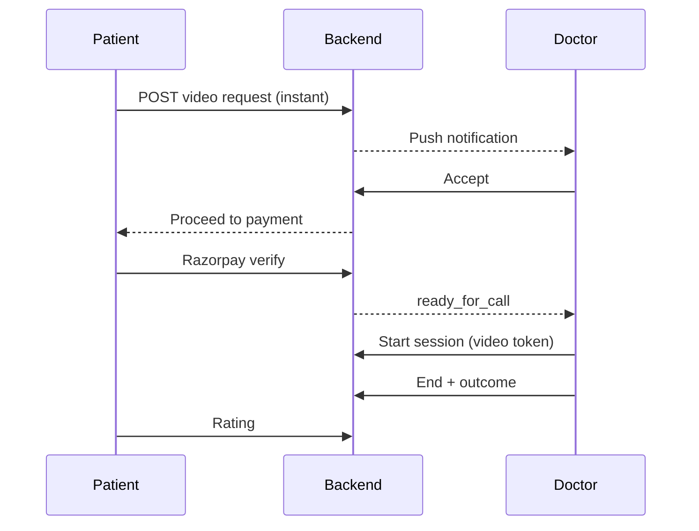

# TimesMed — Backend Requirement Specification (BRS)

| Field | Value |
|-------|-------|
| **Product** | TimesMed Health Care |
| **Client** | Flutter (Android / iOS / desktop) |
| **Document** | Backend Requirement Specification |
| **Version** | 3.0 |
| **Date** | 20 July 2026 |
| **Audience** | Backend engineers, DBAs, QA, Product |
| **Source** | Full Flutter codebase analysis (`lib/` ~208 files) |
| **Companion** | [`APP_FLOW.md`](APP_FLOW.md) |

> **Purpose:** Define APIs, entities, validations, RBAC, payments, notifications, and audit so the backend can be built from this document alone.

> **Mobile today:** UI flows are mock (`Future.delayed`, dummy lists). `ApiClient` + Bearer interceptor exist under `lib/core/network/` but are **never constructed** (zero call sites). Only stub path constants: `/Login/Login_Check`, `/Login/Logout` (unused). Tokens are never written on login. Razorpay uses client test key without server `order_id`. Patient can generate a **local** prescription PDF; doctor print is snackbar-only. This BRS is the **target** contract the app must integrate to.

---

## Table of Contents

1. [System Overview](#1-system-overview)
2. [Roles & Client Flavors](#2-roles--client-flavors)
3. [Application Flows (Backend View)](#3-application-flows-backend-view)
4. [Global API Conventions](#4-global-api-conventions)
5. [Authentication](#5-authentication)
6. [Patient Family Profiles](#6-patient-family-profiles)
7. [Masters & Discovery](#7-masters--discovery)
8. [Doctor Profile & Organization](#8-doctor-profile--organization)
9. [Facilities (Hospital / Clinic)](#9-facilities-hospital--clinic)
10. [Appointments — Clinical](#10-appointments--clinical)
11. [Appointments — Video & Queue](#11-appointments--video--queue)
12. [Doctor Operations](#12-doctor-operations)
13. [Prescriptions & Templates](#13-prescriptions--templates)
14. [Clinical Notes & Vitals](#14-clinical-notes--vitals)
15. [Medical Records](#15-medical-records)
16. [Pharmacy / Medicine Orders](#16-pharmacy--medicine-orders)
17. [Lab Bookings](#17-lab-bookings)
18. [Payments (Razorpay)](#18-payments-razorpay)
19. [Notifications](#19-notifications)
20. [Ratings](#20-ratings)
21. [Dashboards](#21-dashboards)
22. [AI Chat](#22-ai-chat)
23. [File Uploads & PDF Generation](#23-file-uploads--pdf-generation)
24. [Pharmacy & Admin (Future)](#24-pharmacy--admin-future)
25. [Database Entities](#25-database-entities)
26. [RBAC Matrix](#26-rbac-matrix)
27. [Validations Summary](#27-validations-summary)
28. [Implementation Priority Checklist](#28-implementation-priority-checklist)
29. [Screen Field Catalog](#29-screen-field-catalog)

---

## 1. System Overview

TimesMed connects **patients** and **doctors** (pharmacy/admin planned) for:

- Clinical (in-clinic) and video consultations
- Prescriptions, medicine delivery orders, lab bookings
- Doctor queue, call outcomes, clinical documentation
- Org setup: facilities, hired doctors, schedules, letterhead/signature
- Canonical **server-generated PDFs** for prescriptions and lab reports

### Client technical constraints

| Item | Requirement |
|------|-------------|
| Style | REST + JSON |
| Auth header | `Authorization: Bearer <access_token>` |
| Content-Type | `application/json` (multipart for files) |
| Timeout | 30 seconds (matches `ApiClient`) |
| Base URL | Per flavor / env (`AppConfig.baseUrl`) — replace placeholder `https://yourapi.com/api` |
| Payments | Razorpay — amounts in **paise**; **server-created `order_id` required** |
| Maps | Return lat/lng for labs / tracking |
| Video | Provide session tokens for WebRTC/SDK (not in app yet) |
| Push | FCM (app currently has local notifications only) |
| PDF | Prefer server PDF URL; patient app already has local `MedicalPdfHelper` as fallback |

### What mobile already expects after login

| Secure storage key | Meaning |
|--------------------|---------|
| `auth_token` | Access JWT |
| `refresh_token` | Refresh JWT |
| `user_role` | `patient` \| `doctor` \| `pharmacy` \| `admin` |

Also used locally today (must move to API): `doctor_profile`, `doctor_registry`.

---

## 2. Roles & Client Flavors

| Role | Flavor entry | Intended home after auth |
|------|--------------|--------------------------|
| `patient` | `main_patient` / Super | Family selection → patient shell |
| `doctor` | `main_doctor` / Super | Doctor shell (dashboard or waiting list) |
| `pharmacy` | Future | Pharmacy home |
| `admin` | Future | Admin dashboard |

**Not in product:** receptionist / clinic-admin roles — do not invent APIs for them unless product adds them.

**Active patient context (required):** After family selection, client must hold `selected_patient_id` (not implemented today). All clinical/booking APIs must accept or infer this patient profile id.

---

## 3. Application Flows (Backend View)

### 3.1 Cold start

```
App launch → Splash
  → no token → flavor login / super picker
  → token → GET /me (optional) → role home
```

### 3.2 Patient happy paths

```
Login → Select family patient → Home/Dashboard
  ├ Clinical: Filter → Doctors → Details → Slots → Pay → Confirm
  ├ Video Instant: Request → Doctor Accept → Pay → Queue → Call → Rate
  ├ Video Schedule: Slots → Pay → Queue/Call → Rate
  ├ Records → [Download Rx PDF] → Cart → Address → Pay → Track order
  └ Lab Visit | Home Collection → Pay → Track
```

### 3.3 Doctor happy paths

```
Login → Shell
  ├ Notifications: Accept/Reject → wait payment → Start call
  ├ Waiting → Video → Rx / Lab / Notes / History → End → Outcome
  ├ Missed → Reschedule
  └ Menu: Profile, Hired doctors (+ hospital assignment), Facilities, Signature
```

### 3.4 Instant video sequence



---

## 4. Global API Conventions

### Base path

Prefer: `/api/v1/...`

### Envelope

```json
{
  "success": true,
  "message": "optional",
  "data": {},
  "errors": null
}
```

### Errors

| HTTP | Meaning |
|------|---------|
| 400 | Validation |
| 401 | Missing/invalid token |
| 403 | Role / ownership forbidden |
| 404 | Not found |
| 409 | Conflict (slot taken, duplicate) |
| 429 | Rate limit (OTP) |
| 500 | Server error |

### Pagination

`?page=1&page_size=20` → `{ items, page, page_size, total }`

### IDs

Opaque string IDs (`usr_…`, `pat_…`, `doc_…`, `apt_…`). Snake_case JSON keys (client medical models already use `patient_id`, `lab_tests`, etc.).

### Idempotency

Payment verify and booking create should accept `Idempotency-Key` header.

---

## 5. Authentication

### 5.1 Rules from UI

| Rule | Patient | Doctor |
|------|---------|--------|
| Mobile | Exactly 10 digits | Exactly 10 digits |
| OTP | Exactly 6 digits | Exactly 6 digits |
| Email password | Non-empty (signup min 6 recommended) | Exactly **6 digits** |
| Post-login | Family selection | Doctor dashboard |

Recommended server policies: OTP TTL **5 min**, max **3** verify attempts, resend cooldown **30–60s**.

### 5.2 Tables

`users`, `otp_challenges`, `refresh_tokens`, `login_audit`

### 5.3 APIs

#### POST `/api/v1/auth/otp/send` — Public

```json
{ "mobile": "9876543210", "role": "patient", "purpose": "login" }
```

Success: `{ otp_expires_in_seconds, resend_after_seconds, masked_mobile }`

#### POST `/api/v1/auth/otp/verify` — Public

```json
{ "mobile": "9876543210", "otp": "123456", "role": "patient" }
```

Success:

```json
{
  "access_token": "<jwt>",
  "refresh_token": "<jwt>",
  "expires_in": 3600,
  "user": {
    "id": "usr_01",
    "role": "patient",
    "mobile": "9876543210",
    "email": null,
    "is_profile_complete": true
  }
}
```

#### POST `/api/v1/auth/login/email` — Public

```json
{ "email": "doctor@timesmed.com", "password": "123456", "role": "doctor" }
```

Same token envelope.

#### POST `/api/v1/auth/register` — Public (patient)

Fields from signup UI: `name`, `email`, `dob`, `age`, `gender` (`Male`|`Female`|`Others`), `phone`, `password`, `confirm_password`, `marital_status` (`Single`|`Married`).

Creates `user` + default Self `patient_profile`.

#### POST `/api/v1/auth/password/forgot` — Public

`{ "email_or_mobile", "role" }` → OTP / reset path

#### POST `/api/v1/auth/password/verify-otp` — Public

#### POST `/api/v1/auth/password/reset` — Public

`{ "reset_token", "new_password", "confirm_password" }`

#### POST `/api/v1/auth/refresh` — Public (refresh token)

#### POST `/api/v1/auth/logout` — Auth

Invalidate refresh token.

#### GET `/api/v1/me` — Auth

Current user + role-specific summary.

> **Replace** legacy stub paths `/Login/Login_Check` and `/Login/Logout` — do not implement those as the production contract.

---

## 6. Patient Family Profiles

### Entity `patient_profiles`

| Field | Type | Notes |
|-------|------|-------|
| id | string | |
| account_user_id | string | Login account |
| name | string | |
| relation | string | Self, Son, Daughter, Wife, Brother, Sister, Friend, Mother, Father… |
| gender | enum | Male, Female, Others |
| age | int | Or derive from dob |
| dob | date | |
| marital_status | enum | Single, Married |
| photo_url | string? | |
| phone | string? | Dependents may inherit |

Matches client `PatientSelectionModel`: `id`, `name`, `relation`, `gender`, `age`.

### APIs

| Method | Path | Purpose |
|--------|------|---------|
| GET | `/api/v1/patients` | List family profiles for account |
| POST | `/api/v1/patients` | Create dependent (add-patient fields) |
| GET | `/api/v1/patients/{id}` | Detail |
| PUT/PATCH | `/api/v1/patients/{id}` | Update |
| DELETE | `/api/v1/patients/{id}` | Soft-delete (if allowed) |

---

## 7. Masters & Discovery

| Method | Path | Purpose |
|--------|------|---------|
| GET | `/api/v1/masters/cities` | Cities for clinical filter |
| GET | `/api/v1/masters/areas?city=` | Locations / areas |
| GET | `/api/v1/masters/hospitals?city=&area=` | Hospital list |
| GET | `/api/v1/masters/specialities` | Specialities |
| GET | `/api/v1/masters/languages` | Languages for video filter |
| GET | `/api/v1/masters/symptoms` | Symptoms |
| GET | `/api/v1/masters/drugs?q=` | Drug search for Rx |
| GET | `/api/v1/masters/lab-departments` | Lab departments + tests |

Public doctor discovery:

| Method | Path | Purpose |
|--------|------|---------|
| GET | `/api/v1/doctors` | Search: city, hospital, speciality, language, query |
| GET | `/api/v1/doctors/{id}` | Detail (degree, experience, fee, image, media) |
| GET | `/api/v1/doctors/{id}/slots` | Available slots by date / session / mode |

---

## 8. Doctor Profile & Organization

Aligned with client `DoctorFormData`, `DoctorSignatureData`, `HiredDoctor`, `DoctorRegistry`.

### 8.1 Doctor me

| Method | Path | Purpose |
|--------|------|---------|
| GET | `/api/v1/doctor/me` | Profile + letterhead fields |
| PUT | `/api/v1/doctor/me` | Update basic details |
| PUT | `/api/v1/doctor/me/signature` | Signature strokes + printed name/qualification |
| PUT | `/api/v1/doctor/me/avatar` | Avatar upload |

**DoctorFormData fields:** first_name, last_name, dob, gender, mobile, email, experience, qualification, specialisations[], category, languages[], address.

**Signature:** strokes (point arrays), doctor_name, qualification, specialisation, clinic, reg_no, city.

### 8.2 Org doctors (hired)

Matches `HiredDoctor`: `id`, `is_main`, form fields, `hospital_ids[]`.

| Method | Path | Purpose |
|--------|------|---------|
| GET | `/api/v1/doctor/org/doctors` | Main + hired doctors |
| POST | `/api/v1/doctor/org/doctors` | Add hired doctor |
| PUT | `/api/v1/doctor/org/doctors/{id}` | Update |
| DELETE | `/api/v1/doctor/org/doctors/{id}` | Remove (not main) |
| PUT | `/api/v1/doctor/org/doctors/{id}/assignments` | Set facility ids (many-to-many) |

---

## 9. Facilities (Hospital / Clinic)

Matches hospital list UI: Clinic/Hospital, Own/Partner, visit schedule, online schedule, text/video fees.

| Method | Path | Purpose |
|--------|------|---------|
| GET | `/api/v1/doctor/facilities` | List org facilities |
| POST | `/api/v1/doctor/facilities` | Create |
| PUT | `/api/v1/doctor/facilities/{id}` | Update |
| DELETE | `/api/v1/doctor/facilities/{id}` | Delete |
| PUT | `/api/v1/doctor/facilities/{id}/visit-schedule` | Visit slots |
| PUT | `/api/v1/doctor/facilities/{id}/online-schedule` | Online slots |
| PUT | `/api/v1/doctor/facilities/{id}/pricing` | Fees |

**Facility fields:** name, phone, type (clinic|hospital), category (own|partner), address, lat/lng optional.

---

## 10. Appointments — Clinical

| Method | Path | Purpose |
|--------|------|---------|
| POST | `/api/v1/appointments/clinical` | Book after payment verify (or create pending + pay) |
| GET | `/api/v1/appointments/{id}` | Detail |
| GET | `/api/v1/appointments` | Patient list (filters) |

**Create body (from UI):** patient_id, doctor_id, facility_id?, date, session, slot_time, fee_paise, payment_id.

**Fee rule:** Server is source of truth. Client currently shows schedule INR 550 but charges INR 500 — API must return one `payable_amount_paise`.

---

## 11. Appointments — Video & Queue

| Method | Path | Purpose |
|--------|------|---------|
| POST | `/api/v1/appointments/video/instant` | Instant request |
| POST | `/api/v1/consult-requests/{id}/accept` | Doctor accept |
| POST | `/api/v1/consult-requests/{id}/reject` | Doctor reject |
| POST | `/api/v1/appointments/video/scheduled` | Scheduled video book |
| GET | `/api/v1/appointments/{id}/queue` | Queue position / countdown |
| POST | `/api/v1/appointments/{id}/documents` | Upload pdf/jpg/png for queue |
| POST | `/api/v1/video/sessions` | Create session tokens (WebRTC/SDK) |
| POST | `/api/v1/consultations/{id}/end` | End + outcome |

**Outcome payload (from end-call UI):** type = `free_review` | `paid_revisit` | `complete`; optional follow-up slots.

**Instant status machine (matches doctor notifications):** `incoming` → `waiting_payment` → `ready_for_call` → `in_call` → `completed` / `rejected`.

---

## 12. Doctor Operations

| Method | Path | Purpose |
|--------|------|---------|
| GET | `/api/v1/doctor/waiting-list` | Online + in-person queues |
| GET | `/api/v1/doctor/calendar?date=` | Day appointments |
| GET | `/api/v1/doctor/call-logs` | Past calls + tasks |
| GET | `/api/v1/doctor/missed-calls` | Missed list |
| POST | `/api/v1/appointments/{id}/reschedule` | New slot |
| GET | `/api/v1/doctor/appointments` | Schedule lists by filter/title |
| GET | `/api/v1/doctor/patients` | Doctor-registered patients |
| POST | `/api/v1/doctor/patients` | Register patient |
| GET | `/api/v1/doctor/consult-requests` | Instant/video/follow-up requests |
| GET | `/api/v1/doctor/dashboard/stats?from=&to=` | Count cards |

**WaitingPatient shape:** appointment_id, type, name, phone, payment_status, waiting_status, date, time.

**CallLog shape:** patient_name, phone, fee, type, status, datetime, progress_note, tasks[].

**Doctor patient register fields:** registration_number, first_name, last_name, age, gender, phone, whatsapp, email, password, target_inr_from, target_inr_to.

---

## 13. Prescriptions & Templates

| Method | Path | Purpose |
|--------|------|---------|
| POST | `/api/v1/doctor/prescriptions` | Create Rx for appointment |
| GET | `/api/v1/doctor/prescriptions/{id}` | Detail |
| GET | `/api/v1/doctor/prescriptions/{id}/pdf` | Server PDF (canonical) |
| GET | `/api/v1/doctor/prescription-templates` | List |
| POST | `/api/v1/doctor/prescription-templates` | Create |
| PUT | `/api/v1/doctor/prescription-templates/{id}` | Update |
| DELETE | `/api/v1/doctor/prescription-templates/{id}` | Delete |

**Rx line:** drug_name, frequency, days, qty, food_relation, notes/instructions.

**Template:** id, name, description, date, items[].

Include letterhead data (doctor name, qualification, specialisation, clinic, reg_no, city, signature image URL) on PDF.

---

## 14. Clinical Notes & Vitals

| Method | Path | Purpose |
|--------|------|---------|
| GET | `/api/v1/doctor/appointments/{id}/clinical-notes` | List |
| POST | `/api/v1/doctor/appointments/{id}/clinical-notes` | Create |
| PUT | `/api/v1/doctor/clinical-notes/{id}` | Update |
| GET | `/api/v1/doctor/lab/catalog` | Departments + tests |
| POST | `/api/v1/doctor/lab/requests` | Create lab request |
| GET | `/api/v1/doctor/lab/requests` | List / filter |
| PUT | `/api/v1/doctor/lab/requests/{id}` | Update status |

**ClinicalNote:** height, weight, pulse, temperature, disease_complaints, allergies, symptoms, diagnosis, causes, investigation.

**LabTestRecord:** department, tests[], urgent (bool), notes, status (`pending`|`in_progress`|`completed`).

---

## 15. Medical Records

Must match client `MedicalRecordModel` JSON keys.

| Method | Path | Purpose |
|--------|------|---------|
| GET | `/api/v1/medical-records` | Patient list (or doctor treated) |
| GET | `/api/v1/medical-records/{id}` | Detail |
| GET | `/api/v1/medical-records/{id}/prescription-pdf` | PDF bytes/URL |
| GET | `/api/v1/medical-records/{id}/lab-report-pdf` | PDF bytes/URL |

**Record fields:** id, patient_id, patient_name, doctor_id, doctor_name, speciality, visit_id, date, time, status, diagnosis, notes, prescriptions[], lab_tests[].

**PrescriptionItem:** medicine_id, medicine_name, frequency, days, instructions, quantity, price.

**LabTest:** category, test_name, instructions.

---

## 16. Pharmacy / Medicine Orders

| Method | Path | Purpose |
|--------|------|---------|
| GET | `/api/v1/addresses` | List |
| POST | `/api/v1/addresses` | Create |
| PUT | `/api/v1/addresses/{id}` | Update |
| DELETE | `/api/v1/addresses/{id}` | Delete |
| POST | `/api/v1/orders/medicine` | Create from record/cart |
| GET | `/api/v1/orders/medicine` | List |
| GET | `/api/v1/orders/medicine/{id}` | Detail |
| GET | `/api/v1/orders/medicine/{id}/tracking` | Steps + map |

**AddressModel:** name, phone, email, country, state, landmark, address, pincode.

**Pricing:** server computes subtotal + delivery + tax (client mock ≈ INR 630). Do not trust client totals.

---

## 17. Lab Bookings

| Method | Path | Purpose |
|--------|------|---------|
| GET | `/api/v1/labs/nearby` | Nearby labs for selected tests |
| GET | `/api/v1/labs/{id}/slots` | Visit slots |
| POST | `/api/v1/lab-bookings/visit` | Visit lab booking |
| POST | `/api/v1/lab-bookings/home-collection` | Home collection |
| GET | `/api/v1/lab-bookings/{id}` | Detail |
| GET | `/api/v1/lab-bookings/{id}/tracking` | Status steps |

**Visit pricing:** lab.price × number_of_tests (server).  
**Home collection mock reference:** test INR 799×n + collection 99 + platform 29 — replace with real tariff tables.

**Home address fields:** name, mobile, address, landmark, pincode, address_type.

---

## 18. Payments (Razorpay)

| Method | Path | Purpose |
|--------|------|---------|
| POST | `/api/v1/payments/razorpay/order` | Create order — returns `order_id`, amount_paise, currency, key_id |
| POST | `/api/v1/payments/razorpay/verify` | Verify signature + mark paid |
| POST | `/api/v1/payments/razorpay/webhook` | Razorpay webhooks |

**Flows using payment:** clinical, video, medicine order, visit lab, home collection.

**Rules**

1. Never trust client amount alone — recompute on server  
2. Return `order_id` for Razorpay checkout (client currently omits it)  
3. Verify `razorpay_order_id`, `razorpay_payment_id`, `razorpay_signature`  
4. Idempotent verify  
5. Link payment to appointment / order / lab booking  

---

## 19. Notifications

| Method | Path | Purpose |
|--------|------|---------|
| POST | `/api/v1/devices` | Register FCM token + platform |
| DELETE | `/api/v1/devices/{id}` | Unregister |
| GET | `/api/v1/notifications` | In-app inbox |
| POST | `/api/v1/notifications/{id}/read` | Mark read |

**Doctor consult notification payload:** appointment_id, patient name/phone, consult_type, date/time labels, status.

Push events at minimum: instant request, payment cleared / ready_for_call, appointment reminders, order/lab status.

---

## 20. Ratings

| Method | Path | Purpose |
|--------|------|---------|
| POST | `/api/v1/appointments/{id}/rating` | stars 1–5 + feedback |

Required after patient video call UI.

---

## 21. Dashboards

| Method | Path | Purpose |
|--------|------|---------|
| GET | `/api/v1/patient/home` | Upcoming + CTAs data |
| GET | `/api/v1/patient/dashboard` | Stat tiles (real counts) |
| GET | `/api/v1/doctor/dashboard/stats` | Nine+ count cards + date range |

---

## 22. AI Chat

| Method | Path | Purpose |
|--------|------|---------|
| POST | `/api/v1/ai/chat` | Message + user_type (patient\|doctor) |
| GET | `/api/v1/ai/sessions/{id}` | History |

MVP can be keyword/FAQ; later LLM. Do not expose PHI to third parties without consent/logging policy.

---

## 23. File Uploads & PDF Generation

| Method | Path | Purpose |
|--------|------|---------|
| POST | `/api/v1/uploads` | Multipart: avatar, signature image, queue docs, labs |

| Use case | Storage | Types |
|----------|---------|-------|
| Avatar / signature | user/doctor assets | jpg/png |
| Queue documents | appointment documents | pdf/jpg/png |
| Rx / record PDF | generated server-side | pdf |

Return `{ url, file_id }`. Virus-scan + size limits.

### PDF requirements (canonical)

| Document | Endpoint | Content |
|----------|----------|---------|
| Prescription | `/medical-records/{id}/prescription-pdf` or `/doctor/prescriptions/{id}/pdf` | Header, patient, visit_id, date, medicines table (name, frequency, days, instructions), notes, doctor name + speciality (+ letterhead/signature) |
| Lab report | `/medical-records/{id}/lab-report-pdf` | Patient, visit, lab tests, status |

Patient app already builds a local Rx PDF via `MedicalPdfHelper`; once server PDFs exist, prefer downloading the server URL so doctor/patient share one document.

Appointment list "Print" on doctor side should call a server PDF or printable HTML — not implemented in client today.

---

## 24. Pharmacy & Admin (Future)

Client has route constants only; pharmacy login is empty Scaffold. Admin module does not exist. No receptionist role.

**Minimum future scope**

| Role | Needs |
|------|-------|
| Pharmacy | Login, order inbox, accept/reject, dispatch status updates, inventory optional |
| Admin | Login, user/doctor verification, facility approval, masters CRUD, reports |

Do not block patient/doctor MVP on these.

---

## 25. Database Entities

### Core

`users`, `refresh_tokens`, `otp_challenges`, `login_audit`, `devices`

### Patient

`patient_profiles`, `addresses`

### Doctor / org

`doctor_profiles`, `doctor_signatures`, `hired_doctors`, `facilities`, `facility_visit_schedules`, `facility_online_schedules`, `doctor_facility_assignments`

### Clinical

`appointments`, `consult_requests`, `appointment_slots` (or generate from schedules), `video_sessions`, `consultation_outcomes`, `vitals`, `clinical_notes`, `prescriptions`, `prescription_items`, `prescription_templates`, `template_items`, `lab_requests`, `lab_request_items`, `medical_records`

### Commerce

`payments`, `medicine_orders`, `medicine_order_items`, `order_tracking_events`, `lab_bookings`, `lab_booking_tests`, `labs` (partner master)

### Engagement

`ratings`, `notifications`, `ai_sessions`, `ai_messages`, `uploads`

### Relationships (summary)

```
User 1—N PatientProfile
DoctorProfile 1—N HiredDoctor / self
Doctor N—N Facility
PatientProfile 1—N Appointment 1—1 Payment?
Appointment 1—1 MedicalRecord?
MedicalRecord 1—N PrescriptionItem, LabTest snapshot
PrescriptionItem → MedicineOrder
LabTest → LabBooking
Appointment 1—N ClinicalNote, LabRequest, Rating
```

---

## 26. RBAC Matrix

| Resource | Patient | Doctor | Pharmacy | Admin |
|----------|---------|--------|----------|-------|
| Own family profiles | CRUD | — | — | R |
| Book appointments | C | — | — | R |
| Own appointments | R | R (assigned) | — | R |
| Accept consult | — | U | — | — |
| Write Rx / notes / lab req | — | C | — | R |
| Own medical records | R | R (treated) | — | R |
| Medicine orders | C/R | — | U status | R |
| Lab bookings | C/R | C request | — | R |
| Facilities / hired docs | — | CRUD own org | — | CRUD |
| Masters | R | R | R | CRUD |
| Payments verify | C own | — | — | R |
| AI chat | C | C | — | — |
| PDF download | R own | R treated | — | R |

Always enforce ownership: patient_id ∈ account; doctor only on assigned appointments/org.

---

## 27. Validations Summary

| Field | Rule |
|-------|------|
| Mobile | 10 digits |
| OTP | 6 digits |
| Doctor password | 6 digits |
| Patient password | min 6 (recommend complexity later) |
| Gender | Male \| Female \| Others |
| Marital | Single \| Married |
| Relation | enum matching add-patient UI |
| Appointment slot | must be free; reject 409 if taken |
| Payment amount | must match server order |
| Rating | 1–5 integer |
| File types | pdf, jpg, png where applicable |
| Pincode | serviceable for home collection / delivery |

---

## 28. Implementation Priority Checklist

### P0 — Must have for first integration

- [ ] Auth OTP + email + refresh + logout; client must persist tokens
- [ ] Patient family list + create; selected patient context
- [ ] Specialities + doctor search + slots
- [ ] Clinical book + Razorpay order/verify
- [ ] Video instant request + doctor accept/reject + pay + session token
- [ ] Waiting list + end consultation outcome
- [ ] Prescription create + medical records read
- [ ] FCM basics for consult notifications

### P1

- [ ] Medicine order + addresses + tracking
- [ ] Lab visit + home collection + tracking
- [ ] Doctor facilities, schedules, hired doctors, assignments, signature
- [ ] Call logs / missed / reschedule / vitals
- [ ] Clinical notes + lab requests
- [ ] Ratings + patient/doctor dashboards
- [ ] Server prescription PDF

### P2

- [ ] Prescription templates + lab report PDF
- [ ] AI chat backend
- [ ] Pharmacy / Admin modules
- [ ] Wallet / emergency / home care (dashboard placeholders)

---

## 29. Screen Field Catalog

### Patient auth / profile

| Screen | Fields |
|--------|--------|
| Login | mobile (10), otp (6), email, password |
| Signup | name, email, dob, age, gender, phone, password, confirm, marital |
| Forgot | phone, otp, new_password, confirm |
| Selection | patient cards (id, name, relation, gender, age) |
| Add patient | photo, first, last, dob, age, gender, marital, relationship |
| Profile | name, phone, email, password masked, gender |

### Clinical / video

| Screen | Fields |
|--------|--------|
| Clinical filter | city, location, hospital, speciality |
| Doctor list/details | name, degree, speciality, experience, fee, image, media tabs |
| Schedule | date, session, slot time |
| Video filter | doctor, speciality, symptoms, language, query |
| Queue | countdown, documents |
| Rating | stars 1–5, feedback |

### Medical / commerce

| Screen | Fields |
|--------|--------|
| Record | see MedicalRecordModel |
| Cart | PrescriptionItem qty editable |
| Address | AddressModel × shipping/billing |
| Order track | order code, eta, map lat/lng, steps |
| Lab nearby | name, distance, rating, time, address, tests, price |
| Home collection address | name, mobile, address, landmark, pincode, address_type |

### Doctor

| Screen | Fields |
|--------|--------|
| Dashboard | date range + 9+ count cards |
| Waiting | WaitingPatient shape |
| Call logs | CallLog + tasks |
| Missed | name, date, time, payment_status |
| Prescription | drug lines + advice |
| Templates | name, description, drugs |
| Notes | vitals + narrative fields |
| Lab request | department, tests, urgent, notes |
| Basic details | DoctorFormData + signature |
| Hospital | facility + visit + online + pricing |
| Doctor list | HiredDoctor + hospital assignment |
| Register patient | registration + demographics + target INR |
| Notifications | AppNotification status machine |
| End call | outcome tabs + follow-up slots |

---

## Appendix A — Suggested Route Map (Quick Index)

```
/auth/*                    otp, login, register, password, refresh, logout
/me
/patients/*
/masters/*
/doctors/*                 search, detail, slots
/appointments/*            clinical, video, reschedule, rating, queue, documents
/consult-requests/*        accept, reject
/video/sessions
/consultations/*/end
/doctor/me, /doctor/org/*, /doctor/facilities/*
/doctor/waiting-list, /doctor/call-logs, /doctor/missed-calls
/doctor/dashboard/stats, /doctor/appointments*, /doctor/patients*
/doctor/prescriptions*, /doctor/prescription-templates*
/doctor/lab/*, clinical-notes, notifications
/medical-records*
/orders/medicine*, /addresses*
/labs/*, /lab-bookings*
/payments/razorpay/*
/devices, /uploads/*, /ai/chat
/patient/home, /patient/dashboard
```

---

## Appendix B — Client Integration Gaps (must fix on mobile)

1. Save `auth_token`, `refresh_token`, `user_role` on login  
2. Persist `selected_patient_id` after selection  
3. Pass booking context (doctor, slot, fee) through payment → confirmation  
4. Create Razorpay order on server; send `order_id`; verify signature  
5. Register pharmacy/admin routes or remove Super App tiles  
6. Wire lab entry with `tests` extra  
7. Replace mock video with real SDK using `/video/sessions`  
8. Align schedule fee display with payable amount from API  
9. Construct and use `ApiClient` (currently zero call sites)  
10. Prefer server PDF URLs over local-only generation for shared documents  

---

## Appendix C — Mobile vs Backend Status Matrix

| Area | Mobile today | Backend must provide |
|------|--------------|----------------------|
| Auth | Mock delay; no token write | OTP/email JWT + refresh |
| Patient bookings | Dummy lists + Razorpay test | Search, slots, book, pay |
| Video | Static UI | Instant request, FCM, session tokens |
| Doctor queue | Dummy waiting list | Waiting list + status machine |
| Rx | Doctor mock send; patient local PDF | Persist Rx + server PDF |
| Org setup | Local secure store (profile/registry) | CRUD facilities, hired doctors, assignments |
| Labs / pharmacy orders | Mock UI | Bookings, tracking, tariffs |
| Pharmacy/Admin apps | Not built | Defer to P2 |

---

*Flow documentation: [`APP_FLOW.md`](APP_FLOW.md)*  
*Engineering notes: [`CODE_ANALYSIS.md`](../CODE_ANALYSIS.md)*
